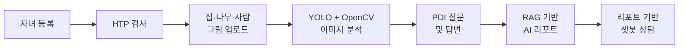
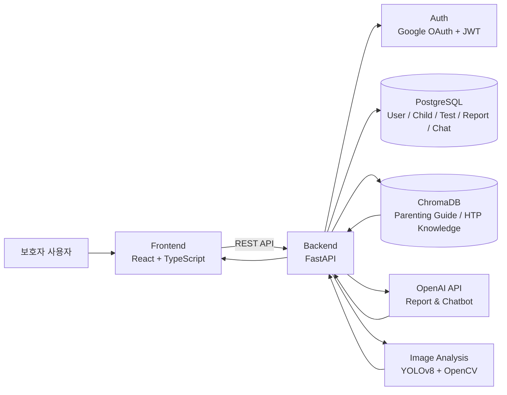
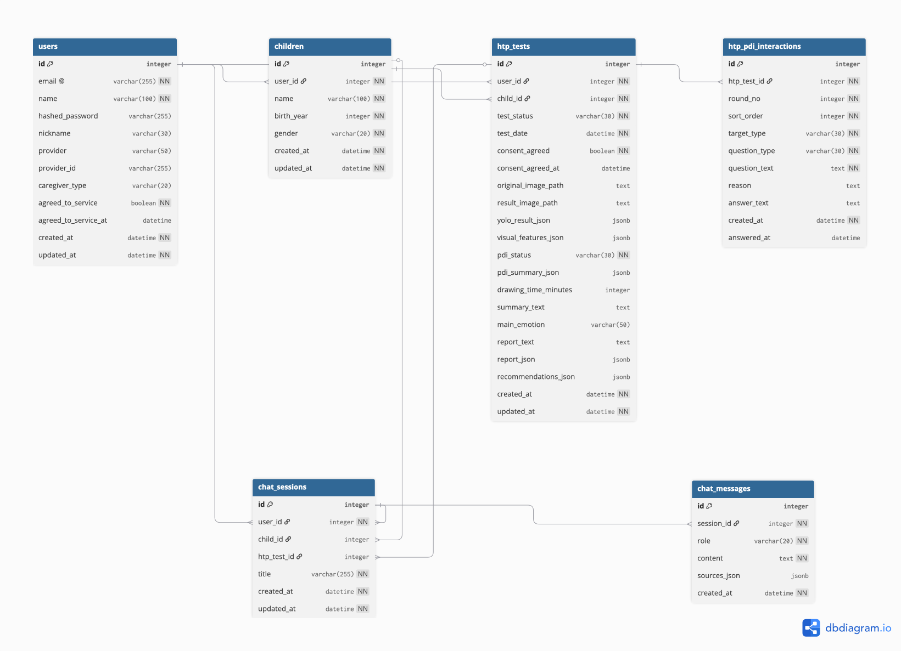

# 🎨 GDAM (그담)

  
  
  
  
  
  

아동 HTP 그림 검사와 PDI 답변을 기반으로 보호자에게 참고용 리포트와 양육 상담 챗봇을 제공하는 AI 기반 양육 지원 서비스

---

## 📌 Overview

GDAM(그담)은 아동의 HTP(House-Tree-Person) 그림 검사와 PDI(Post Drawing Interview) 답변을 기반으로, 보호자가 자녀의 정서와 행동을 이해하는 데 참고할 수 있는 AI 리포트와 양육 상담 챗봇을 제공하는 서비스입니다.

그림에서 집, 나무, 사람 객체를 탐지하고 시각적 특징을 추출한 뒤, 추가 질문 답변과 함께 RAG 기반 지식 데이터를 활용하여 보호자 친화적인 리포트를 생성합니다.

> 본 서비스는 보호자 양육 지원을 위한 참고용 서비스이며, 의료적 진단이나 전문 상담을 대체하지 않습니다.

---

## ✨ Key Features

### 🖼 HTP Drawing Test
- 집, 나무, 사람 그림 업로드
- YOLO 기반 객체 탐지
- 그림 요소의 위치, 크기, 비율 등 분석

### 💬 PDI Interview
- 그림 분석 결과 기반 추가 질문 생성
- 보호자 답변 입력 및 질문 스킵
- PDI 답변을 리포트 생성에 반영

### 📄 AI Report
- HTP 지식 데이터 기반 RAG 검색
- 이미지 분석 결과와 PDI 답변 통합
- OpenAI API 기반 참고용 리포트 생성
- 보호자가 이해하기 쉬운 구조화된 결과 제공

### 🤖 Parenting Chatbot
- 양육 가이드 데이터셋 기반 RAG 검색
- 일반 양육 상담
- HTP 리포트 기반 상담
- 최근 대화 흐름을 반영한 답변 생성

---

## 🔄 Service Flow

---

## 🏗 System Architecture

---

## 🗄 Database ERD

  

---

## 🛠 Tech Stack

| 영역 | 기술 |
| --- | --- |
| Frontend | React, TypeScript, TailwindCSS, Zustand, React Query, Axios |
| Backend | FastAPI, Uvicorn |
| Database | PostgreSQL |
| ORM | SQLAlchemy |
| AI / LLM | OpenAI API |
| RAG / Vector DB | ChromaDB, OpenAI Embedding |
| Image Analysis | YOLOv8, OpenCV |
| Authentication | Google OAuth, JWT |
| Infra | AWS EC2, Nginx, HTTPS |

---

## 📦 Repositories

| 구분 | Repository | 역할 |
| --- | --- | --- |
| Frontend | 🔗 [Frontend](https://github.com/sai-art-therapy/frontend) | 사용자 화면, 검사/리포트/챗봇 UI |
| Backend | 🔗 [Backend](https://github.com/sai-art-therapy/backend) | API 서버, DB, RAG, 리포트 및 챗봇 로직 |
| AI / Model | 🔗 [AI](https://github.com/sai-art-therapy/ai) | YOLO 기반 이미지 분석 및 특징 추출 |

---

## 👥 Team

- 김민지
- 김민하
- 김하영
- 박하은
- 이희원

---

## ⚠️ Notice

- 본 서비스는 보호자 양육 지원을 위한 참고용 서비스입니다.
- HTP 리포트와 챗봇 답변은 의료적 진단이나 전문 상담을 대체하지 않습니다.
- 실제 심리 평가가 필요한 경우 전문가 상담을 권장합니다.
- `.env`, API Key, DB URL, Secret Key 등 민감정보는 레포지토리에 포함하지 않습니다.

---

### Capstone Design Project · 2026
AI-based Parenting Support Service using HTP Drawing Analysis
